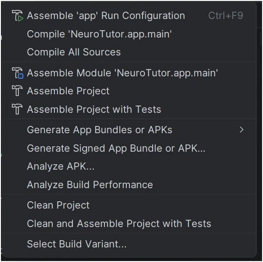
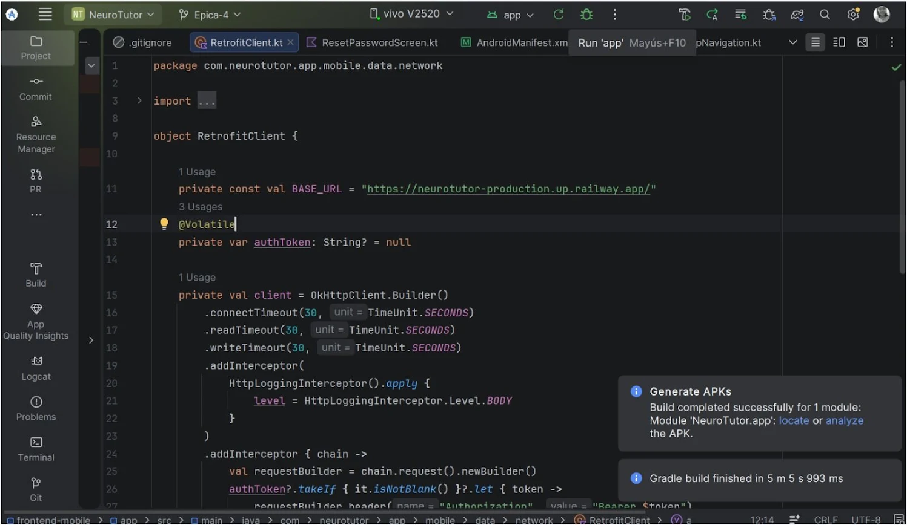

# 📱 Despliegue de la Aplicación Android

La aplicación móvil **NeuroTutor** fue desplegada mediante la generación de un archivo **APK**, el cual permite instalar la aplicación en cualquier dispositivo Android sin necesidad de publicarla en Google Play Store. El APK generado consume los servicios REST del backend desplegado en **Railway**, permitiendo acceder a todas las funcionalidades de la aplicación.

---

## Paso 1. Generar el APK

En Android Studio seleccionar:

```text
Build
→ Build Bundle(s) / APK(s)
→ Build APK(s)
```

Esta opción compila el proyecto y genera un archivo APK listo para instalar en dispositivos Android.

<p align="center">
    
</p>

---

## Paso 2. Esperar la compilación

Android Studio iniciará automáticamente el proceso de compilación del proyecto.

Cuando la compilación finaliza correctamente aparece el siguiente mensaje:

```text
Build completed successfully
```

<p align="center">
    
</p>

---

## Paso 3. Localizar el APK

Seleccionar la opción:

```text
Locate
```

para abrir la carpeta donde Android Studio almacenó el APK generado.

La ruta generada es:

```text
frontend-mobile/
└── app/
    └── build/
        └── outputs/
            └── apk/
                └── debug/
                    └── app-debug.apk
```

---

## Paso 4. Distribución del APK

El archivo generado **app-debug.apk** puede compartirse mediante:

- Google Drive
- WhatsApp
- Telegram
- Correo electrónico
- Memoria USB

---

## Paso 5. Instalación en un dispositivo Android

En el dispositivo Android:

1. Descargar el archivo **app-debug.apk**.
2. Abrir el archivo.
3. Permitir la instalación desde orígenes desconocidos si Android lo solicita.
4. Presionar **Instalar**.
5. Esperar a que finalice la instalación.

Una vez instalada la aplicación, el usuario podrá acceder a NeuroTutor desde el menú de aplicaciones del dispositivo.

---

## Conexión con el Backend

La aplicación móvil se comunica con el backend desplegado en **Railway** mediante una API REST segura utilizando HTTPS.

URL del backend:

```text
https://neurotutor-production.up.railway.app/
```

Al iniciar la aplicación, todas las solicitudes de autenticación, diagnóstico, progreso, logros y tutor inteligente son enviadas al backend, el cual procesa la información y responde a la aplicación móvil.

---

## Resultado del despliegue

El despliegue permitió generar exitosamente el archivo **app-debug.apk**, el cual puede instalarse en dispositivos Android y conectarse al backend desplegado en Railway para utilizar todas las funcionalidades implementadas en NeuroTutor.
