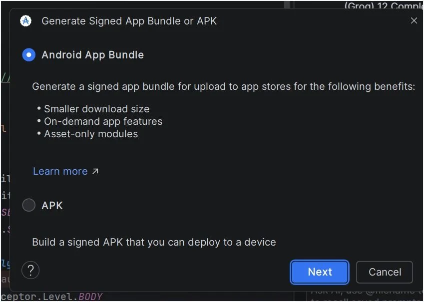
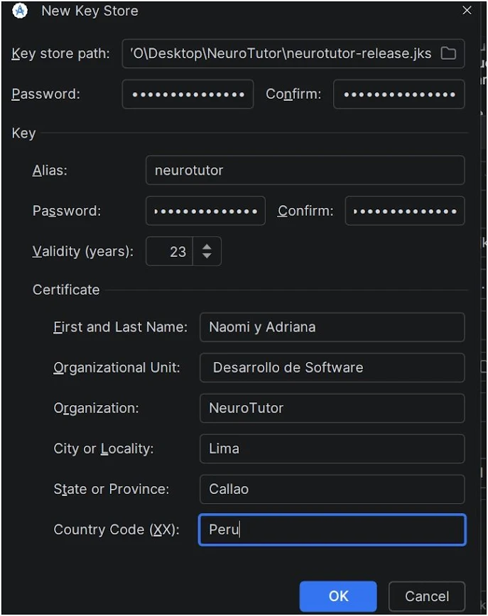

# 📱 Despliegue de la Aplicación Android

La aplicación móvil **NeuroTutor** fue desplegada mediante la generación de un archivo **APK**, el cual permite instalar la aplicación en cualquier dispositivo Android sin necesidad de publicarla en Google Play Store. El APK generado consume los servicios REST del backend desplegado en **Railway**, permitiendo acceder a todas las funcionalidades de la aplicación.

---

## Paso 1. Abrir el asistente de generación del APK

En Android Studio seleccionar:

```text
Build
→ Generate Signed App Bundle or APK...
```

Esta opción abre el asistente para generar un APK listo para ser distribuido e instalado en dispositivos Android.

<p align="center">
    
</p>
---

## Paso 2. Seleccionar el tipo de archivo

En el asistente de generación seleccionar la opción:

```text
APK
```

Luego presionar **Next** para continuar con la configuración del despliegue.

<p align="center">
    
</p>
---

## Paso 3. Configurar el KeyStore

Si es la primera vez que se genera un APK firmado, seleccionar:

```text
Create new...
```

En caso de contar con un KeyStore previamente creado, seleccionar:

```text
Choose existing...
```

El KeyStore almacena el certificado digital utilizado para firmar la aplicación.

<p align="center">
    
</p>
```

---

## Paso 4. Distribución del APK

El archivo generado **app-debug.apk** puede compartirse mediante:

- Google Drive
- WhatsApp
- Telegram
- Correo electrónico
- Memoria USB

---

## Paso 5. Generar el APK

Android Studio compila automáticamente el proyecto.

Al finalizar el proceso aparece el mensaje:

```text
Build completed successfully
```

Seleccionar **Locate** para abrir la carpeta donde fue generado el archivo APK.

<p align="center">
    
</p>.

---

## Conexión con el Backend

La aplicación móvil se comunica con el backend desplegado en **Railway** mediante una API REST segura utilizando HTTPS.

URL del backend:

```text
https://neurotutor-production.up.railway.app/
```

Al iniciar la aplicación, todas las solicitudes de autenticación, diagnóstico, progreso, logros y tutor inteligente son enviadas al backend, el cual procesa la información y responde a la aplicación móvil.

---

## Resultado del despliegue

El despliegue permitió generar exitosamente el archivo **app-debug.apk**, el cual puede instalarse en dispositivos Android y conectarse al backend desplegado en Railway para utilizar todas las funcionalidades implementadas en NeuroTutor.
