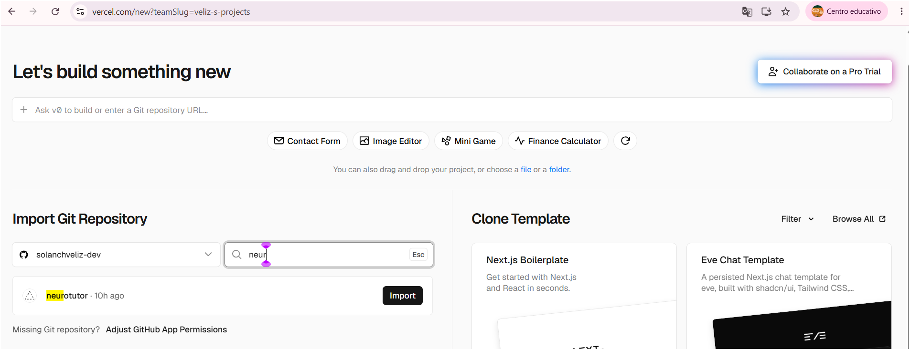
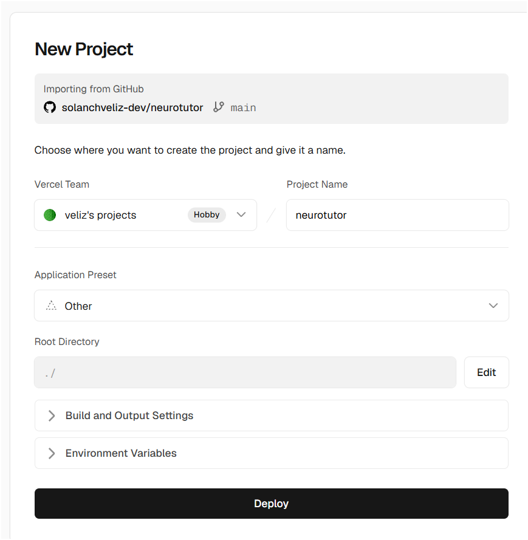
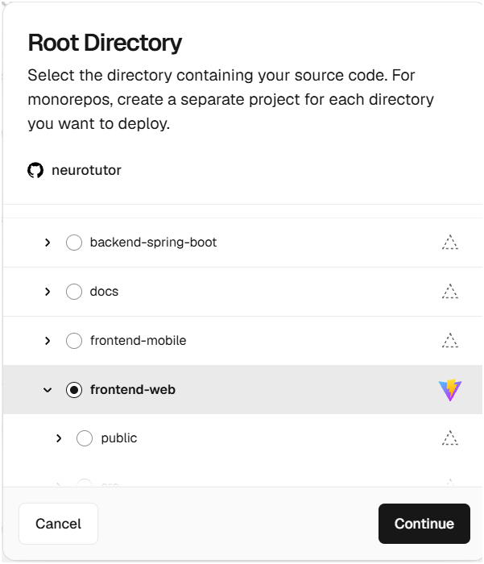
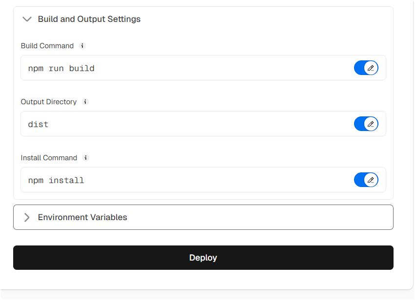
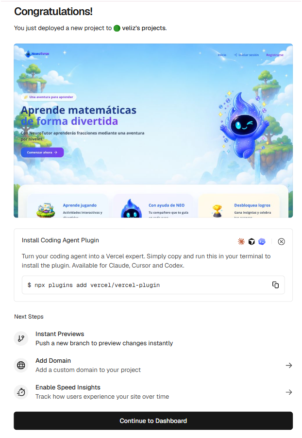
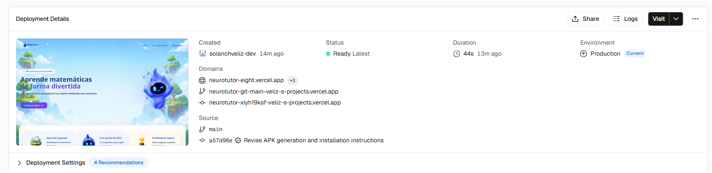

# 📱 Despliegue de la Aplicación Android

La aplicación móvil **NeuroTutor** fue desplegada mediante la generación de un archivo **APK**, el cual permite instalar la aplicación en cualquier dispositivo Android sin necesidad de publicarla en Google Play Store. El APK generado consume los servicios REST del backend desplegado en **Railway**, permitiendo acceder a todas las funcionalidades de la aplicación.

---

## Paso 1. Abrir el asistente de generación del APK

En Android Studio seleccionar:

```text
Build
→ Generate Signed App Bundle or APK...
```

Esta opción abre el asistente para generar un APK listo para ser distribuido e instalado en dispositivos Android.

<p align="center">
    
</p>
---

## Paso 2. Seleccionar el tipo de archivo

En el asistente de generación seleccionar la opción:

```text
APK
```

Luego presionar **Next** para continuar con la configuración del despliegue.

<p align="center">
    
</p>
---

## Paso 3. Configurar el KeyStore

Si es la primera vez que se genera un APK firmado, seleccionar:

```text
Create new...
```

En caso de contar con un KeyStore previamente creado, seleccionar:

```text
Choose existing...
```

El KeyStore almacena el certificado digital utilizado para firmar la aplicación.

<p align="center">
    
</p>
```

---

## Paso 4. Distribución del APK

El archivo generado **app-debug.apk** puede compartirse mediante:

- Google Drive
- WhatsApp
- Telegram
- Correo electrónico
- Memoria USB

---

## Paso 5. Generar el APK

Android Studio compila automáticamente el proyecto.

Al finalizar el proceso aparece el mensaje:

```text
Build completed successfully
```

Seleccionar **Locate** para abrir la carpeta donde fue generado el archivo APK.

<p align="center">
    
</p>.

---

## Conexión con el Backend

La aplicación móvil se comunica con el backend desplegado en **Railway** mediante una API REST segura utilizando HTTPS.

URL del backend:

```text
https://neurotutor-production.up.railway.app/
```

Al iniciar la aplicación, todas las solicitudes de autenticación, diagnóstico, progreso, logros y tutor inteligente son enviadas al backend, el cual procesa la información y responde a la aplicación móvil.

---

## Resultado del despliegue

El despliegue permitió generar exitosamente el archivo **app-debug.apk**, el cual puede instalarse en dispositivos Android y conectarse al backend desplegado en Railway para utilizar todas las funcionalidades implementadas en NeuroTutor.

---

# 🌐 Despliegue de la Aplicación Web

La aplicación web **NeuroTutor** fue desplegada utilizando **Vercel**, una plataforma especializada para aplicaciones desarrolladas con React y Vite. El despliegue se realizó directamente desde el repositorio de GitHub utilizando la rama principal (**main**), permitiendo publicar automáticamente cada nueva actualización enviada al repositorio.

La aplicación consume los servicios REST del backend desplegado en **Railway**, lo que permite acceder a todas las funcionalidades implementadas en NeuroTutor.

---

## Paso 1. Crear un nuevo proyecto en Vercel

Ingresar a la plataforma de **Vercel** e iniciar sesión con una cuenta vinculada a GitHub.

Seleccionar:

```text
Add New
→ Project
```

Posteriormente importar el repositorio donde se encuentra el proyecto.

<p align="center">
    
</p>

<p align="center">
    
</p>
---

## Paso 2. Seleccionar el directorio raíz

Como el repositorio contiene múltiples proyectos, se debe seleccionar únicamente el proyecto correspondiente al frontend web.

Root Directory:

```text
frontend-web
```

<p align="center">
    
</p>

---

## Paso 3. Configurar la construcción del proyecto

Vercel detecta automáticamente que el proyecto utiliza **Vite**.

La configuración utilizada fue la siguiente:

```text
Framework Preset:
Vite

Install Command:
npm install

Build Command:
npm run build

Output Directory:
dist
```

<p align="center">
    
</p>

---

## Paso 4. Configurar las variables de entorno

Para que la aplicación web pueda comunicarse correctamente con el backend desplegado en Railway se configuró la siguiente variable de entorno:

```text
VITE_API_URL=https://neurotutor-production.up.railway.app
```

Esta variable permite que todas las solicitudes HTTP realizadas desde el frontend sean enviadas al backend.


---

## Paso 5. Ejecutar el despliegue

Una vez configurado el proyecto, seleccionar:

```text
Deploy
```

Vercel compila automáticamente la aplicación y genera una URL pública de acceso.

Al finalizar correctamente el proceso aparece el mensaje indicando que el proyecto fue desplegado exitosamente.

<p align="center">
    
</p>

<p align="center">
    
</p>

---

## URL de Producción

La aplicación web quedó disponible públicamente en la siguiente dirección:

```text
https://neurotutor-eight.vercel.app/
```

---

## Conexión con el Backend

La aplicación web se comunica con el backend desplegado en **Railway** mediante una API REST utilizando HTTPS.

URL del backend:

```text
https://neurotutor-production.up.railway.app/
```

Todas las operaciones realizadas desde el frontend, como autenticación, registro de usuarios, examen diagnóstico, consulta de módulos, teoría, prácticas, exámenes finales, progreso e insignias, son procesadas por el backend y almacenadas en la base de datos.

---

## Arquitectura del Despliegue

```text
GitHub (Repositorio)
        │
        ▼
Vercel (Frontend React + Vite)
        │
        ▼
Railway (Backend Spring Boot)
        │
        ▼
Base de Datos MySQL
```

---

## Resultado del Despliegue

El despliegue fue realizado exitosamente utilizando **Vercel**, permitiendo acceder a NeuroTutor desde cualquier navegador mediante una URL pública.

La aplicación web consume correctamente los servicios REST del backend desplegado en Railway, garantizando el funcionamiento de todas las funcionalidades implementadas durante el desarrollo del proyecto.